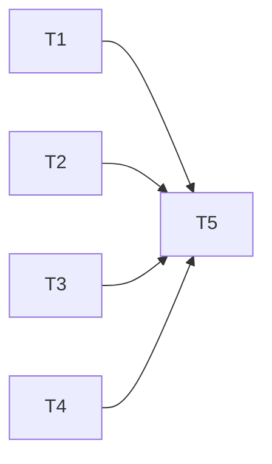

# Plan: Revue Issues GitHub et Ameliorations

> **Specs**: .backlog/tasks/2026-03-08-github-issues-review/spec.md
> **Cree le**: 2026-03-08
> **Status**: En attente de validation

## Metriques
- **Taches totales**: 5
- **Vagues**: 2
- **Parallelisation max**: 4 agents simultanes
- **Complexite globale**: S
- **Estimation temps agent**: 2h (sequentiel)
- **Estimation temps parallele**: 45min (avec parallelisation)

## Vue d'Ensemble

Le plan est organise en 2 vagues. La vague 1 contient 4 taches completement independantes (fix bug, cleanup deps, dockerignore, reponse issue #1). La vague 2 ferme les issues resolues et depend de rien techniquement mais est separee car elle constitue la finalisation.

Toutes les taches sont de petite taille (S) et passent par des subagents.

## Diagramme de Dependances



---

## Vague 1 (Parallele - Aucune dependance)

**Objectif**: Corriger le bug #4, nettoyer les dependances, ajouter .dockerignore, repondre issue #1
**Duree estimee**: 30min (tache la plus longue)

| ID | Tache | Agent | Complexite | Estimation | Fichiers | Dependances |
|----|-------|-------|------------|------------|----------|-------------|
| T1 | ✅ Termine - Fix type conversion errors (Issue #4) | developer-python | S | 30min | `src/jfc/clients/jellyfin.py` | - |
| T2 | ✅ Termine - Supprimer dependances inutiles | developer-python | S | 15min | `pyproject.toml` | - |
| T3 | ✅ Creer .dockerignore | developer-python | S | 10min | `.dockerignore` | - |
| T4 | ✅ Termine - Repondre issue #1 (documentation franchises) | developer-python | S | 15min | - (GitHub CLI) | - |

### T1: Fix type conversion errors dans jellyfin.py (Issue #4)

**Agent**: developer-python
**Complexite**: S (< 30min)

**Description**:
Ajouter une methode statique ou fonction helper `_safe_int()` dans `JellyfinClient` qui convertit securisee les provider IDs en entiers. Remplacer les 6 appels `int()` directs par cette fonction.

La fonction doit:
1. Accepter `Optional[str]` et retourner `Optional[int]`
2. Tenter `int(value)` directement
3. En cas de ValueError, extraire la partie numerique initiale via `re.match(r'(\d+)', value)`
4. Retourner None si la valeur est None, vide, ou non-numerique

**Fichiers concernes**:
- `src/jfc/clients/jellyfin.py` - modifier (ajouter import re, ajouter helper, remplacer 6 appels)

**Lignes a modifier**:
- L108: `int(provider_ids["Tmdb"])` -> `_safe_int(provider_ids.get("Tmdb"))`
- L110: `int(provider_ids["Tvdb"])` -> `_safe_int(provider_ids.get("Tvdb"))`
- L166: `int(provider_ids["Tmdb"])` -> `_safe_int(provider_ids.get("Tmdb"))`
- L168: `int(provider_ids["Tvdb"])` -> `_safe_int(provider_ids.get("Tvdb"))`
- L231: `int(item_tmdb_id)` -> `_safe_int(item_tmdb_id)`
- L233: `int(provider_ids["Tvdb"])` -> `_safe_int(provider_ids.get("Tvdb"))`

**Validation**:
- [ ] Fonction `_safe_int()` presente et correcte
- [ ] 6 appels int() remplaces
- [ ] Slug `73375-jack-ryan` parse correctement en `73375`
- [ ] Valeur None retourne None
- [ ] Le code compile sans erreur

---

### T2: Supprimer dependances inutiles

**Agent**: developer-python
**Complexite**: S (< 15min)

**Description**:
Supprimer les 3 dependances jamais utilisees de `pyproject.toml`:
- `fastapi>=0.109.0`
- `uvicorn[standard]>=0.27.0`
- `aiohttp>=3.9.0`

Supprimer aussi le commentaire `# Web Framework` qui accompagne fastapi/uvicorn, et ajuster le commentaire `# HTTP Clients` pour ne garder que httpx.

**Fichiers concernes**:
- `pyproject.toml` - modifier

**Validation**:
- [ ] fastapi supprime
- [ ] uvicorn supprime
- [ ] aiohttp supprime
- [ ] Commentaires de section ajustes
- [ ] Structure TOML valide

---

### T3: Creer .dockerignore

**Agent**: developer-python
**Complexite**: S (< 10min)

**Description**:
Creer un fichier `.dockerignore` a la racine du projet avec les exclusions appropriees pour reduire le contexte de build Docker.

**Fichiers concernes**:
- `.dockerignore` - creer

**Contenu**:
```
# Version control
.git/
.gitignore

# Python
__pycache__/
*.pyc
*.pyo
*.egg-info/
dist/
build/
.venv/
venv/

# Environment
.env
.env.*

# Data and logs (mounted as volumes)
logs/
data/

# Development
.mypy_cache/
.pytest_cache/
.ruff_cache/
htmlcov/
.coverage

# IDE
.idea/
.vscode/

# Project management
.backlog/

# Docs (except README needed for pip install)
*.md
!README.md

# Docker
docker-compose*.yml
```

**Validation**:
- [ ] Fichier .dockerignore cree a la racine
- [ ] Exclut .git, .venv, logs, data, caches, IDE
- [ ] Preserve README.md (requis par pyproject.toml)

---

### T4: Repondre issue #1 (documentation franchises)

**Agent**: developer-python
**Complexite**: S (< 15min)

**Description**:
Poster un commentaire sur l'issue GitHub #1 avec des exemples concrets de configuration YAML pour les collections franchise/universe. Utiliser `gh issue comment` via GitHub CLI.

Le commentaire doit inclure:
1. Explication que JFC supporte les franchises via `tmdb_list`, `trakt_list`, `mdblist_list`
2. Exemple MCU avec `tmdb_list`
3. Exemple Star Wars avec `trakt_list`
4. Exemple generique avec `mdblist_list`
5. Lien vers la documentation des builders supportes si existant

**Actions**:
```bash
gh issue comment 1 --body "..."
```

**Validation**:
- [ ] Commentaire poste sur issue #1
- [ ] Exemples YAML valides et fonctionnels
- [ ] Utilise les builders supportes par le projet

---

## Vague 2 (Sequentielle - Apres Vague 1)

**Objectif**: Fermer les issues resolues avec commentaires explicatifs
**Duree estimee**: 15min

| ID | Tache | Agent | Complexite | Estimation | Fichiers | Dependances |
|----|-------|-------|------------|------------|----------|-------------|
| T5 | ✅ Termine - Fermer issues #2 et #3 | developer-python | S | 15min | - (GitHub CLI) | T1, T2, T3, T4 |

### T5: Fermer issues resolues (#2 et #3)

**Agent**: developer-python
**Complexite**: S (< 15min)

**Description**:
Commenter et fermer les issues #2 et #3 qui sont deja resolues dans le code actuel.

**Issue #2** - Loading library limited to 10,000 items:
- Expliquer que la pagination a ete implementee avec un maximum de 50,000 items
- Mentionner la methode `get_library_items()` dans `jellyfin.py`

**Issue #3** - plex_search and TMDb issues:
- Expliquer que plex_search fonctionne maintenant via le builder Jellyfin
- Expliquer que la pagination TMDb est implementee (plus de limite a 20 resultats)

**Actions**:
```bash
gh issue comment 2 --body "..."
gh issue close 2
gh issue comment 3 --body "..."
gh issue close 3
```

**Validation**:
- [ ] Issue #2 commentee et fermee
- [ ] Issue #3 commentee et fermee
- [ ] Commentaires contiennent des explications techniques

---

## Chemin Critique

```
T1 (30min) -> T5 (15min) = 45min
```

Le chemin critique est de 45 minutes. Les taches T2, T3, T4 s'executent en parallele avec T1 et ne sont pas sur le chemin critique.

---

## Risques Identifies

| Risque | Impact | Probabilite | Mitigation |
|--------|--------|-------------|------------|
| GitHub CLI (`gh`) non installe ou non authentifie | Moyen | Moyen | Documenter les commandes a executer manuellement |
| Provider IDs avec formats inattendus (pas que des slugs) | Faible | Faible | La regex `(\d+)` est permissive et gere la plupart des cas |
| Dependances fastapi/uvicorn utilisees indirectement | Faible | Tres faible | Verification grep deja faite - aucun import |

---

## Notes pour l'Orchestrateur

- Les taches T2 et T4 sont tres rapides et pourraient etre combinees, mais elles sont separees pour clarte et parallelisation.
- La vague 2 (T5) est separee car c'est une action de finalisation (fermeture d'issues). Elle pourrait techniquement etre en vague 1 mais il est preferable d'avoir le fix du bug (T1) committe avant de fermer les issues.
- Si `gh` CLI n'est pas disponible, les taches T4 et T5 devront etre faites manuellement via l'interface GitHub.

---

**Execution Vague 1** (pas de dependance):
```
Task(subagent_type="agent-factory:developers:developer-python", prompt="T1: Fix type conversion errors dans jellyfin.py (Issue #4)
CONTEXTE: Tache github-issues-review, Specs: D:/Projects/jellyfin-collection/.backlog/tasks/2026-03-08-github-issues-review/spec.md
ACTION: Dans src/jfc/clients/jellyfin.py:
1. Ajouter 'import re' en haut du fichier si pas deja present
2. Ajouter une fonction helper _safe_int(value: str | None) -> int | None au niveau module ou comme methode statique:
   - Si value est None ou vide, retourner None
   - Tenter int(value), retourner le resultat
   - En cas de ValueError, tenter re.match(r'(\d+)', str(value)) et retourner int(match.group(1)) si match
   - Sinon retourner None
3. Remplacer les 6 appels int() sur provider IDs:
   - L108: int(provider_ids['Tmdb']) -> _safe_int(provider_ids.get('Tmdb'))
   - L110: int(provider_ids['Tvdb']) -> _safe_int(provider_ids.get('Tvdb'))
   - L166: int(provider_ids['Tmdb']) -> _safe_int(provider_ids.get('Tmdb'))
   - L168: int(provider_ids['Tvdb']) -> _safe_int(provider_ids.get('Tvdb'))
   - L231: int(item_tmdb_id) -> _safe_int(item_tmdb_id)
   - L233: int(provider_ids['Tvdb']) -> _safe_int(provider_ids.get('Tvdb'))
4. Supprimer les conditions ternaires 'if provider_ids.get(X) else None' car _safe_int gere deja None
LIVRABLES: src/jfc/clients/jellyfin.py modifie
POST-ACTION: Marquer T1 TERMINE dans plan.md")

Task(subagent_type="agent-factory:developers:developer-python", prompt="T2: Supprimer dependances inutiles de pyproject.toml
CONTEXTE: Tache github-issues-review, Specs: D:/Projects/jellyfin-collection/.backlog/tasks/2026-03-08-github-issues-review/spec.md
ACTION: Dans pyproject.toml:
1. Supprimer la ligne '\"fastapi>=0.109.0\",'
2. Supprimer la ligne '\"uvicorn[standard]>=0.27.0\",'
3. Supprimer le commentaire '# Web Framework'
4. Supprimer la ligne '\"aiohttp>=3.9.0\",'
5. Garder le commentaire '# HTTP Clients' avec seulement httpx en dessous
LIVRABLES: pyproject.toml modifie
POST-ACTION: Marquer T2 TERMINE dans plan.md")

Task(subagent_type="agent-factory:developers:developer-python", prompt="T3: Creer .dockerignore
CONTEXTE: Tache github-issues-review, Specs: D:/Projects/jellyfin-collection/.backlog/tasks/2026-03-08-github-issues-review/spec.md
ACTION: Creer le fichier .dockerignore a la racine du projet D:/Projects/jellyfin-collection/.dockerignore avec le contenu suivant:
# Version control
.git/
.gitignore

# Python
__pycache__/
*.pyc
*.pyo
*.egg-info/
dist/
build/
.venv/
venv/

# Environment
.env
.env.*

# Data and logs (mounted as volumes)
logs/
data/

# Development
.mypy_cache/
.pytest_cache/
.ruff_cache/
htmlcov/
.coverage

# IDE
.idea/
.vscode/

# Project management
.backlog/

# Docs (except README needed for pip install)
*.md
!README.md

# Docker
docker-compose*.yml
LIVRABLES: .dockerignore cree
POST-ACTION: Marquer T3 TERMINE dans plan.md")

Task(subagent_type="agent-factory:developers:developer-python", prompt="T4: Repondre issue #1 (documentation franchises)
CONTEXTE: Tache github-issues-review, Specs: D:/Projects/jellyfin-collection/.backlog/tasks/2026-03-08-github-issues-review/spec.md
ACTION: Poster un commentaire sur l'issue GitHub #1 via gh CLI:
gh issue comment 1 --repo 4lx69/jellyfin-collection --body 'Hi! JFC supports franchise/universe collections through list-based builders. Here are some examples:

## Using TMDb Lists

```yaml
collections:
  Marvel Cinematic Universe:
    tmdb_list: 131292
    sync_mode: sync
    sort_title: \"!040_MCU\"
    schedule: weekly(sunday)

  Star Wars (Chronological):
    tmdb_list: 8136
    sync_mode: sync
    schedule: monthly
```

## Using Trakt Lists

```yaml
collections:
  DC Extended Universe:
    trakt_list: https://trakt.tv/users/donxy/lists/dc-extended-universe
    sync_mode: sync
    schedule: monthly
```

## Using MDBList

```yaml
collections:
  Harry Potter:
    mdblist_list: https://mdblist.com/lists/linaspuransen/harry-potter
    sync_mode: sync
    schedule: monthly
```

You can find TMDb list IDs by browsing https://www.themoviedb.org/list/ and using the numeric ID from the URL. For Trakt, use the full list URL.

The `sync_mode: sync` ensures the collection matches the list exactly (adding new items and removing ones no longer in the list). Use `append` if you only want to add new items without removing existing ones.'
Si gh CLI non disponible, documenter la commande dans un fichier .backlog/tasks/2026-03-08-github-issues-review/manual-actions.md
LIVRABLES: Commentaire poste sur issue #1 (ou fichier manual-actions.md)
POST-ACTION: Marquer T4 TERMINE dans plan.md")
```

**Execution Vague 2** (apres completion Vague 1):
```
Task(subagent_type="agent-factory:developers:developer-python", prompt="T5: Fermer issues resolues #2 et #3
CONTEXTE: Tache github-issues-review, Specs: D:/Projects/jellyfin-collection/.backlog/tasks/2026-03-08-github-issues-review/spec.md
ACTION: Commenter et fermer les issues #2 et #3 via gh CLI:

1. Issue #2 (Loading library limited to 10,000 items):
gh issue comment 2 --repo 4lx69/jellyfin-collection --body 'This has been resolved. The library loading now uses pagination with a configurable limit up to 50,000 items (default page size: 2,000). The implementation is in `JellyfinClient.get_library_items()` which fetches items in batches until all are loaded or the 50k ceiling is reached.

If you have a library exceeding 50,000 items, please open a new issue and we can increase the limit further.'
gh issue close 2 --repo 4lx69/jellyfin-collection

2. Issue #3 (plex_search and TMDb issues):
gh issue comment 3 --repo 4lx69/jellyfin-collection --body 'Both issues have been resolved:

1. **plex_search**: Now works correctly as a Jellyfin library search builder. The parser maps `plex_search` configurations to Jellyfin search queries.

2. **TMDb pagination**: TMDb results are now properly paginated. When you set `limit: 50`, the client fetches multiple pages of 20 results each until the requested limit is reached.

These fixes are available in the latest version.'
gh issue close 3 --repo 4lx69/jellyfin-collection

Si gh CLI non disponible, documenter les commandes dans .backlog/tasks/2026-03-08-github-issues-review/manual-actions.md
LIVRABLES: Issues #2 et #3 commentees et fermees (ou fichier manual-actions.md)
POST-ACTION: Marquer T5 TERMINE dans plan.md")
```

---

## Changelog

| Date | Modification | Auteur |
|------|--------------|--------|
| 2026-03-08 | Creation initiale | Planner |
